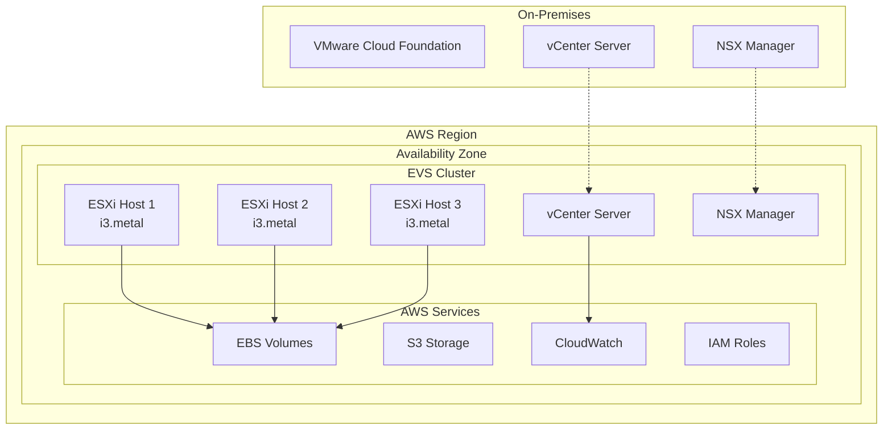
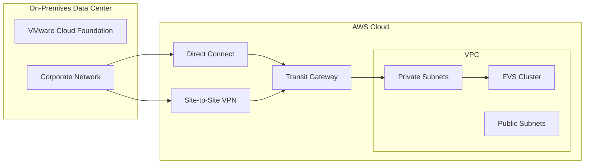

# Architecture Overview

This document provides a comprehensive overview of the VMware Cloud Foundation (VCF) AWS Elastic VMware Service (EVS) integration architecture, based on official AWS documentation.

## What is Amazon Elastic VMware Service (EVS)?

Amazon Elastic VMware Service (EVS) is a fully managed service that provides dedicated, single-tenant VMware vSphere clusters in the AWS Cloud. EVS enables you to run VMware workloads natively on AWS infrastructure while maintaining operational consistency with your on-premises VMware environments.

## Key Components

### EVS Cluster Architecture

### Supported Instance Types

Based on AWS EVS documentation, the following instance types are supported:

| Instance Type | vCPU | Memory (GiB) | Storage | Network Performance |
|---------------|------|--------------|---------|-------------------|
| i3.metal | 72 | 512 | 8 x 1.9 TB NVMe SSD | 25 Gbps |
| i3en.metal | 96 | 768 | 8 x 7.5 TB NVMe SSD | 100 Gbps |
| r5.metal | 96 | 768 | EBS Only | 25 Gbps |
| r5d.metal | 96 | 768 | 4 x 900 GB NVMe SSD | 25 Gbps |
| m5.metal | 96 | 384 | EBS Only | 25 Gbps |
| m5d.metal | 96 | 384 | 4 x 900 GB NVMe SSD | 25 Gbps |

### Network Architecture

EVS clusters are deployed within your AWS VPC and support:

- **Management Network**: For vCenter and ESXi management traffic
- **vMotion Network**: For live VM migration between hosts
- **vSAN Network**: For storage traffic (when using vSAN)
- **VM Network**: For virtual machine traffic

## Integration Patterns

### Hybrid Cloud Connectivity

### Migration Strategies

1. **Lift and Shift**: Direct VM migration using vMotion or cold migration
2. **Hybrid Operations**: Workloads spanning on-premises and cloud
3. **Disaster Recovery**: EVS as DR target for on-premises workloads
4. **Cloud Bursting**: Scale workloads to cloud during peak demand

## Security Architecture

### Network Security

- **Security Groups**: Control traffic at the instance level
- **NACLs**: Subnet-level traffic control
- **NSX Micro-segmentation**: Application-level security policies
- **AWS PrivateLink**: Secure connectivity to AWS services

### Identity and Access Management

- **IAM Roles**: Service-to-service authentication
- **vCenter SSO**: Integration with corporate identity providers
- **AWS SSO**: Centralized access management
- **Multi-factor Authentication**: Enhanced security for administrative access

### Encryption

- **Data at Rest**: EBS volume encryption, vSAN encryption
- **Data in Transit**: TLS/SSL for all management traffic
- **Key Management**: AWS KMS integration for encryption keys

## Monitoring and Observability

### CloudWatch Integration

EVS automatically publishes metrics to CloudWatch:

- **Cluster Health**: Overall cluster status and availability
- **Host Metrics**: CPU, memory, storage utilization per ESXi host
- **VM Metrics**: Performance metrics for individual VMs
- **Network Metrics**: Throughput and packet statistics

### Logging

- **vCenter Logs**: Centralized in CloudWatch Logs
- **ESXi Logs**: Host-level logging and diagnostics
- **NSX Logs**: Network and security event logging
- **API Logs**: CloudTrail integration for audit trails

## Backup and Disaster Recovery

### Backup Strategies

1. **VM-level Backup**: Using VMware vSphere Data Protection
2. **Application-consistent Backup**: With VSS/FSFREEZE integration
3. **Cross-region Replication**: For disaster recovery scenarios
4. **Point-in-time Recovery**: Snapshot-based recovery options

### Disaster Recovery

- **Site Recovery Manager (SRM)**: Automated DR orchestration
- **vSphere Replication**: VM-level replication to DR site
- **Cross-region Failover**: Automated failover to secondary region
- **Recovery Testing**: Non-disruptive DR testing capabilities

## Performance Considerations

### Compute Performance

- **CPU Overcommit**: Recommended ratios based on workload type
- **Memory Management**: Transparent page sharing and ballooning
- **NUMA Optimization**: Host affinity for performance-critical workloads

### Storage Performance

- **vSAN Configuration**: Optimal disk group configurations
- **EBS Optimization**: GP3 vs io2 for different workload patterns
- **Storage Policies**: VM-level storage requirements

### Network Performance

- **SR-IOV**: Hardware-accelerated networking for high-performance workloads
- **Network I/O Control**: QoS policies for different traffic types
- **Jumbo Frames**: MTU optimization for storage and vMotion traffic

## Cost Optimization

### Right-sizing Strategies

- **Instance Type Selection**: Match compute requirements to instance capabilities
- **Cluster Scaling**: Dynamic scaling based on workload demands
- **Reserved Instances**: Cost savings for predictable workloads
- **Spot Integration**: Cost-effective compute for fault-tolerant workloads

### Resource Management

- **DRS (Distributed Resource Scheduler)**: Automated load balancing
- **Storage DRS**: Automated storage load balancing
- **Power Management**: Host power policies for energy efficiency

## Official Documentation References

This architecture overview is based on the following official AWS documentation:

- **[Amazon EVS User Guide (PDF)](https://docs.aws.amazon.com/pdfs/evs/latest/userguide/evs-ug.pdf)** - Comprehensive guide to EVS features and configuration
- **[Amazon EVS Getting Started](https://docs.aws.amazon.com/evs/latest/userguide/getting-started.html)** - Step-by-step setup instructions
- **[Amazon EVS FAQs](https://aws.amazon.com/evs/faqs/)** - Frequently asked questions and answers
- **[Re:Invent 2024 Deep Dive Presentation](https://reinvent.awsevents.com/content/dam/reinvent/2024/slides/mam/MAM237-NEW_Deep-dive-into-Amazon-Elastic-VMware-Service.pdf)** - Technical deep dive session

## Next Steps

1. Review the [Installation Guide](../tutorials/installation.md) to set up the integration toolkit
2. Follow the [Migration Tutorial](../tutorials/migration.md) to migrate your first workload
3. Implement [Monitoring](../tutorials/monitoring.md) for your EVS environment
4. Review [Security Best Practices](security.md) for production deployments