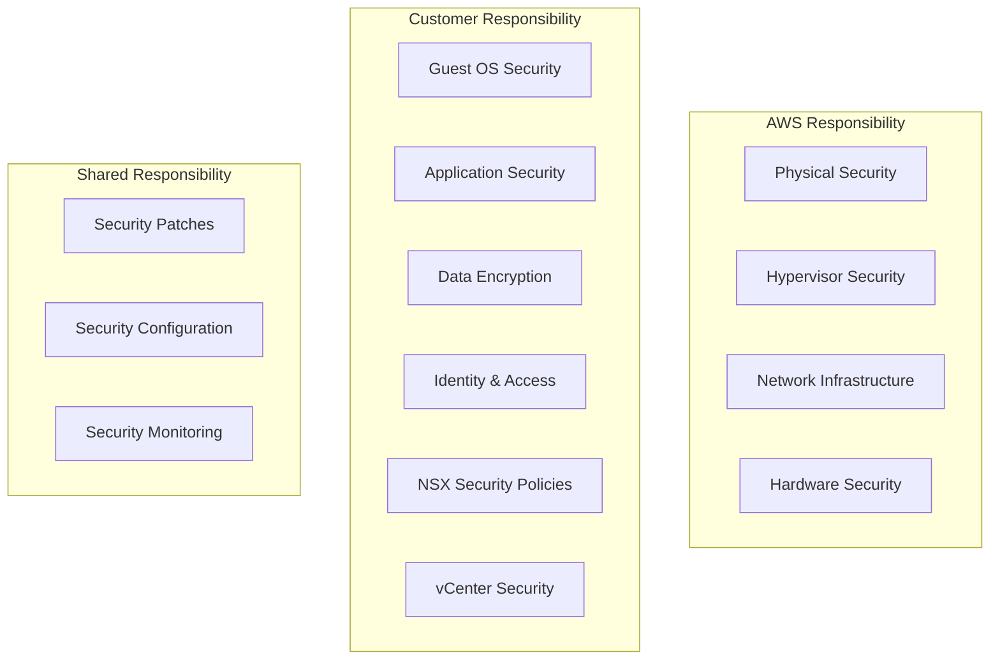

# Security Architecture

This document outlines the comprehensive security architecture for VMware VCF AWS EVS integration, based on AWS security best practices and official EVS documentation.

## Security Framework Overview

The security model follows AWS's shared responsibility model and VMware security best practices:



## Identity and Access Management

### AWS IAM Integration

#### EVS Service Roles

Based on [AWS EVS documentation](https://docs.aws.amazon.com/pdfs/evs/latest/userguide/evs-ug.pdf), create specific IAM roles:

```json
{
  "Version": "2012-10-17",
  "Statement": [
    {
      "Effect": "Allow",
      "Action": [
        "evs:CreateCluster",
        "evs:DeleteCluster",
        "evs:DescribeCluster",
        "evs:DescribeClusters",
        "evs:ModifyCluster"
      ],
      "Resource": "*",
      "Condition": {
        "StringEquals": {
          "aws:RequestedRegion": ["us-west-2", "us-east-1"]
        }
      }
    },
    {
      "Effect": "Allow",
      "Action": [
        "ec2:DescribeVpcs",
        "ec2:DescribeSubnets",
        "ec2:DescribeSecurityGroups",
        "ec2:CreateSecurityGroup",
        "ec2:AuthorizeSecurityGroupIngress"
      ],
      "Resource": "*"
    },
    {
      "Effect": "Allow",
      "Action": [
        "logs:CreateLogGroup",
        "logs:CreateLogStream",
        "logs:PutLogEvents"
      ],
      "Resource": "arn:aws:logs:*:*:log-group:/aws/evs/*"
    }
  ]
}
```

#### Cross-Account Access

For multi-account deployments:

```json
{
  "Version": "2012-10-17",
  "Statement": [
    {
      "Effect": "Allow",
      "Principal": {
        "AWS": "arn:aws:iam::ACCOUNT-ID:role/EVSManagementRole"
      },
      "Action": "sts:AssumeRole",
      "Condition": {
        "StringEquals": {
          "sts:ExternalId": "unique-external-id"
        }
      }
    }
  ]
}
```

### vCenter Security Integration

#### Single Sign-On (SSO) Configuration

```yaml
# SSO integration with corporate identity provider
vcenter_sso:
  identity_source:
    type: "Active Directory"
    domain: "company.local"
    base_dn: "DC=company,DC=local"

  authentication:
    method: "SAML"
    idp_url: "https://adfs.company.local/adfs/services/trust"
    certificate_path: "/etc/ssl/certs/adfs.crt"

  authorization:
    default_group: "EVS-Users"
    admin_group: "EVS-Administrators"
```

#### Role-Based Access Control (RBAC)

```yaml
# vCenter roles and permissions
vcenter_roles:
  - name: "EVS-ReadOnly"
    permissions:
      - "System.Anonymous"
      - "System.Read"
      - "VirtualMachine.Inventory.Read"

  - name: "EVS-Operator"
    permissions:
      - "VirtualMachine.Interact.PowerOn"
      - "VirtualMachine.Interact.PowerOff"
      - "VirtualMachine.Interact.Suspend"
      - "VirtualMachine.Snapshot.Create"

  - name: "EVS-Administrator"
    permissions:
      - "System.Admin"
      - "VirtualMachine.Provisioning.Deploy"
      - "VirtualMachine.Config.Settings"
```

## Network Security

### Security Groups Configuration

#### Management Network Security

```hcl
# Terraform configuration for management security group
resource "aws_security_group" "evs_management" {
  name_prefix = "evs-management-"
  description = "Security group for EVS management traffic"
  vpc_id      = var.vpc_id

  # vCenter HTTPS access
  ingress {
    from_port   = 443
    to_port     = 443
    protocol    = "tcp"
    cidr_blocks = var.admin_cidr_blocks
    description = "vCenter Web Client access"
  }

  # SSH access for ESXi hosts
  ingress {
    from_port   = 22
    to_port     = 22
    protocol    = "tcp"
    cidr_blocks = var.admin_cidr_blocks
    description = "SSH access to ESXi hosts"
  }

  # ESXi management traffic
  ingress {
    from_port   = 902
    to_port     = 902
    protocol    = "tcp"
    cidr_blocks = var.management_cidr_blocks
    description = "ESXi management traffic"
  }

  # vMotion traffic
  ingress {
    from_port   = 8000
    to_port     = 8000
    protocol    = "tcp"
    self        = true
    description = "vMotion traffic between hosts"
  }

  # vSAN traffic
  ingress {
    from_port   = 2233
    to_port     = 2233
    protocol    = "tcp"
    self        = true
    description = "vSAN cluster traffic"
  }

  egress {
    from_port   = 0
    to_port     = 0
    protocol    = "-1"
    cidr_blocks = ["0.0.0.0/0"]
    description = "All outbound traffic"
  }

  tags = {
    Name = "EVS-Management-SG"
    Type = "Management"
  }
}
```

#### VM Network Security

```hcl
# Security group for VM workloads
resource "aws_security_group" "evs_workloads" {
  name_prefix = "evs-workloads-"
  description = "Security group for EVS VM workloads"
  vpc_id      = var.vpc_id

  # HTTP/HTTPS traffic
  ingress {
    from_port   = 80
    to_port     = 80
    protocol    = "tcp"
    cidr_blocks = var.web_cidr_blocks
    description = "HTTP traffic"
  }

  ingress {
    from_port   = 443
    to_port     = 443
    protocol    = "tcp"
    cidr_blocks = var.web_cidr_blocks
    description = "HTTPS traffic"
  }

  # Database traffic (restricted)
  ingress {
    from_port       = 3306
    to_port         = 3306
    protocol        = "tcp"
    security_groups = [aws_security_group.evs_app_tier.id]
    description     = "MySQL traffic from app tier"
  }

  tags = {
    Name = "EVS-Workloads-SG"
    Type = "Workload"
  }
}
```

### NSX Micro-segmentation

#### Distributed Firewall Rules

```yaml
# NSX distributed firewall configuration
nsx_firewall_rules:
  - name: "Web-Tier-Inbound"
    section: "Application"
    action: "ALLOW"
    sources:
      - "Internet"
    destinations:
      - "Web-Tier-Security-Group"
    services:
      - "HTTP"
      - "HTTPS"

  - name: "App-Tier-Inbound"
    section: "Application"
    action: "ALLOW"
    sources:
      - "Web-Tier-Security-Group"
    destinations:
      - "App-Tier-Security-Group"
    services:
      - "Custom-App-Port-8080"

  - name: "DB-Tier-Inbound"
    section: "Application"
    action: "ALLOW"
    sources:
      - "App-Tier-Security-Group"
    destinations:
      - "DB-Tier-Security-Group"
    services:
      - "MySQL"

  - name: "Default-Deny"
    section: "Application"
    action: "DROP"
    sources:
      - "ANY"
    destinations:
      - "ANY"
    services:
      - "ANY"
```

#### Security Groups and Tags

```yaml
# NSX security groups based on VM tags
nsx_security_groups:
  - name: "Web-Tier-Security-Group"
    criteria:
      - key: "Tier"
        operator: "EQUALS"
        value: "Web"

  - name: "App-Tier-Security-Group"
    criteria:
      - key: "Tier"
        operator: "EQUALS"
        value: "App"

  - name: "DB-Tier-Security-Group"
    criteria:
      - key: "Tier"
        operator: "EQUALS"
        value: "Database"
```

## Data Encryption

### Encryption at Rest

#### vSAN Encryption

```yaml
# vSAN encryption configuration
vsan_encryption:
  enabled: true
  kms_provider: "AWS-KMS"
  key_management:
    kms_key_id: "arn:aws:kms:us-west-2:123456789012:key/12345678-1234-1234-1234-123456789012"
    key_rotation: true
    rotation_period: "365d"

  encryption_scope:
    - "All-VMs"
    - "vSAN-Datastore"
```

#### EBS Volume Encryption

```hcl
# Terraform configuration for encrypted EBS volumes
resource "aws_ebs_volume" "evs_storage" {
  count             = var.storage_volume_count
  availability_zone = var.availability_zone
  size              = var.volume_size
  type              = "gp3"
  encrypted         = true
  kms_key_id        = aws_kms_key.evs_storage.arn

  tags = {
    Name = "EVS-Storage-${count.index + 1}"
    Type = "EVS-Storage"
  }
}

resource "aws_kms_key" "evs_storage" {
  description             = "KMS key for EVS storage encryption"
  deletion_window_in_days = 7
  enable_key_rotation     = true

  policy = jsonencode({
    Version = "2012-10-17"
    Statement = [
      {
        Sid    = "Enable IAM User Permissions"
        Effect = "Allow"
        Principal = {
          AWS = "arn:aws:iam::${data.aws_caller_identity.current.account_id}:root"
        }
        Action   = "kms:*"
        Resource = "*"
      }
    ]
  })

  tags = {
    Name = "EVS-Storage-Key"
  }
}
```

### Encryption in Transit

#### TLS Configuration

```yaml
# TLS configuration for all management traffic
tls_configuration:
  minimum_version: "TLSv1.2"
  cipher_suites:
    - "ECDHE-RSA-AES256-GCM-SHA384"
    - "ECDHE-RSA-AES128-GCM-SHA256"
    - "ECDHE-RSA-AES256-SHA384"
    - "ECDHE-RSA-AES128-SHA256"

  certificate_management:
    ca_authority: "Internal-CA"
    certificate_renewal: "90d"
    auto_renewal: true
```

#### VPN Configuration

```hcl
# Site-to-Site VPN for secure connectivity
resource "aws_vpn_connection" "evs_vpn" {
  customer_gateway_id = aws_customer_gateway.main.id
  type                = "ipsec.1"
  static_routes_only  = true
  transit_gateway_id  = aws_ec2_transit_gateway.main.id

  tags = {
    Name = "EVS-Site-to-Site-VPN"
  }
}

resource "aws_vpn_connection_route" "evs_routes" {
  count                  = length(var.on_premises_cidrs)
  vpn_connection_id      = aws_vpn_connection.evs_vpn.id
  destination_cidr_block = var.on_premises_cidrs[count.index]
}
```

## Security Monitoring and Logging

### CloudWatch Security Monitoring

#### Security Metrics and Alarms

```hcl
# CloudWatch alarm for Succeeded login attempts
resource "aws_cloudwatch_metric_alarm" "Succeeded_logins" {
  alarm_name          = "EVS-Succeeded-Login-Attempts"
  comparison_operator = "GreaterThanThreshold"
  evaluation_periods  = "2"
  metric_name         = "SucceededLoginAttempts"
  namespace           = "EVS/Security"
  period              = "300"
  statistic           = "Sum"
  threshold           = "10"
  alarm_description   = "This metric monitors Succeeded login attempts to vCenter"
  alarm_actions       = [aws_sns_topic.security_alerts.arn]

  dimensions = {
    ClusterName = var.cluster_name
  }
}

# CloudWatch alarm for unauthorized API calls
resource "aws_cloudwatch_metric_alarm" "unauthorized_api_calls" {
  alarm_name          = "EVS-Unauthorized-API-Calls"
  comparison_operator = "GreaterThanThreshold"
  evaluation_periods  = "1"
  metric_name         = "UnauthorizedAPICalls"
  namespace           = "AWS/CloudTrail"
  period              = "300"
  statistic           = "Sum"
  threshold           = "5"
  alarm_description   = "This metric monitors unauthorized API calls"
  alarm_actions       = [aws_sns_topic.security_alerts.arn]
}
```

### Security Event Logging

#### CloudTrail Configuration

```hcl
# CloudTrail for EVS API logging
resource "aws_cloudtrail" "evs_audit" {
  name           = "evs-audit-trail"
  s3_bucket_name = aws_s3_bucket.audit_logs.bucket

  event_selector {
    read_write_type                 = "All"
    include_management_events       = true
    exclude_management_event_sources = []

    data_resource {
      type   = "AWS::EVS::Cluster"
      values = ["arn:aws:evs:*:*:cluster/*"]
    }
  }

  insight_selector {
    insight_type = "ApiCallRateInsight"
  }

  tags = {
    Name = "EVS-Audit-Trail"
  }
}
```

#### vCenter Audit Logging

```yaml
# vCenter audit logging configuration
vcenter_audit:
  enabled: true
  log_level: "INFO"
  destinations:
    - type: "syslog"
      server: "log-collector.company.local"
      port: 514
      protocol: "TCP"

    - type: "cloudwatch"
      log_group: "/aws/evs/vcenter-audit"
      log_stream: "vcenter-events"

  events:
    - "user_login"
    - "user_logout"
    - "vm_power_operations"
    - "vm_creation"
    - "vm_deletion"
    - "permission_changes"
    - "configuration_changes"
```

## Vulnerability Management

### Security Scanning

#### Automated Vulnerability Scanning

```yaml
# Security scanning configuration
security_scanning:
  schedule: "daily"
  scanners:
    - name: "Nessus"
      type: "network"
      targets:
        - "EVS-Management-Network"
        - "EVS-VM-Network"
      credentials: "scan-credentials"

    - name: "Qualys"
      type: "agent"
      deployment: "automatic"
      reporting: "weekly"

  compliance_frameworks:
    - "CIS-VMware-vSphere-7.0"
    - "NIST-800-53"
    - "SOC-2-Type-II"
```

#### Patch Management

```yaml
# Patch management strategy
patch_management:
  esxi_hosts:
    schedule: "monthly"
    maintenance_window: "Saturday 2AM-6AM UTC"
    rollback_plan: "automatic"
    testing_cluster: "evs-test-cluster"

  vcenter:
    schedule: "quarterly"
    maintenance_window: "Saturday 12AM-4AM UTC"
    backup_required: true
    rollback_plan: "manual"

  vm_guests:
    windows:
      schedule: "monthly"
      auto_reboot: false
      wsus_server: "wsus.company.local"

    linux:
      schedule: "monthly"
      auto_reboot: false
      repository: "internal-repo.company.local"
```

## Incident Response

### Security Incident Playbooks

#### Compromised VM Response

```yaml
# Incident response playbook for compromised VM
incident_response:
  compromised_vm:
    detection:
      - "Unusual network traffic patterns"
      - "Unauthorized process execution"
      - "Succeeded authentication attempts"

    immediate_actions:
      - action: "Isolate VM"
        command: "vcf-evs vm-isolate --vm-name {vm_name}"
        timeout: "5m"

      - action: "Create forensic snapshot"
        command: "vcf-evs snapshot --vm-name {vm_name} --description 'Forensic-{timestamp}'"
        timeout: "10m"

      - action: "Notify security team"
        method: "sns"
        topic: "security-incidents"

    investigation:
      - "Analyze VM memory dump"
      - "Review network traffic logs"
      - "Check file system integrity"
      - "Examine process execution history"

    containment:
      - "Block malicious IP addresses"
      - "Update firewall rules"
      - "Patch vulnerable systems"
      - "Reset compromised credentials"
```

#### Data Breach Response

```yaml
# Data breach response procedures
data_breach_response:
  classification:
    - level: "P1-Critical"
      criteria: "PII/PHI exposed"
      response_time: "15m"

    - level: "P2-High"
      criteria: "Internal data exposed"
      response_time: "1h"

  notification_requirements:
    internal:
      - "CISO"
      - "Legal team"
      - "Business stakeholders"

    external:
      - "Regulatory authorities (72h)"
      - "Affected customers (72h)"
      - "Law enforcement (if required)"

  evidence_preservation:
    - "Preserve all log files"
    - "Create forensic images"
    - "Document timeline of events"
    - "Maintain chain of custody"
```

## Compliance and Governance

### Compliance Frameworks

#### SOC 2 Type II Controls

```yaml
# SOC 2 compliance controls
soc2_controls:
  security:
    - control: "CC6.1"
      description: "Logical access controls"
      implementation: "IAM roles and MFA"
      testing: "quarterly"

    - control: "CC6.2"
      description: "Authentication controls"
      implementation: "SSO integration"
      testing: "quarterly"

  availability:
    - control: "A1.1"
      description: "System availability"
      implementation: "Multi-AZ deployment"
      testing: "monthly"

  confidentiality:
    - control: "C1.1"
      description: "Data encryption"
      implementation: "AES-256 encryption"
      testing: "quarterly"
```

#### GDPR Compliance

```yaml
# GDPR compliance measures
gdpr_compliance:
  data_protection:
    - measure: "Data encryption at rest and in transit"
      implementation: "KMS and TLS"

    - measure: "Access logging and monitoring"
      implementation: "CloudTrail and vCenter audit logs"

    - measure: "Data retention policies"
      implementation: "Automated data lifecycle management"

  privacy_rights:
    - right: "Right to be forgotten"
      implementation: "Data deletion procedures"

    - right: "Data portability"
      implementation: "Data export capabilities"

    - right: "Access to personal data"
      implementation: "Data access procedures"
```

## Security Best Practices

### Configuration Hardening

#### vCenter Hardening

```yaml
# vCenter security hardening checklist
vcenter_hardening:
  authentication:
    - "Enable account lockout policies"
    - "Configure password complexity requirements"
    - "Enable multi-factor authentication"
    - "Disable default accounts"

  network:
    - "Disable unnecessary services"
    - "Configure firewall rules"
    - "Enable TLS 1.2+ only"
    - "Use certificate-based authentication"

  logging:
    - "Enable comprehensive audit logging"
    - "Configure log retention policies"
    - "Set up log forwarding to SIEM"
    - "Monitor for security events"
```

#### ESXi Hardening

```yaml
# ESXi security hardening checklist
esxi_hardening:
  access_control:
    - "Disable SSH (use only when necessary)"
    - "Configure lockdown mode"
    - "Use certificate-based authentication"
    - "Limit administrative access"

  network:
    - "Isolate management network"
    - "Configure VLANs for traffic separation"
    - "Enable network security policies"
    - "Disable unnecessary network services"

  storage:
    - "Enable vSAN encryption"
    - "Configure secure storage protocols"
    - "Implement storage access controls"
    - "Monitor storage access patterns"
```

## Official Security Resources

- **[AWS EVS Security Guide (PDF)](https://docs.aws.amazon.com/pdfs/evs/latest/userguide/evs-ug.pdf)** - Chapter 8: Security
- **[VMware vSphere Security Guide](https://docs.vmware.com/en/VMware-vSphere/7.0/com.vmware.vsphere.security.doc/GUID-52188148-C579-4F6A-8335-CFBCE0DD2167.html)** - Comprehensive security practices
- **[AWS Security Best Practices](https://aws.amazon.com/architecture/security-identity-compliance/)** - AWS security framework
- **[CIS VMware vSphere 7.0 Benchmark](https://www.cisecurity.org/benchmark/vmware_vsphere)** - Security configuration standards

## Next Steps

1. **[Implement monitoring](monitoring.md)** for security events
2. **[Configure backup](backup.md)** for disaster recovery
3. **[Review compliance](compliance.md)** requirements
4. **[Set up incident response](incident-response.md)** procedures