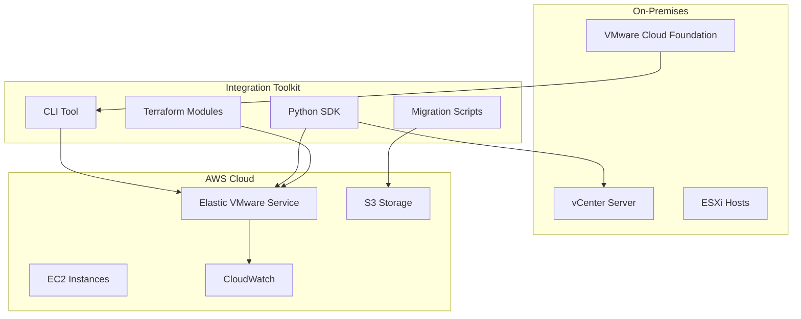

# VMware VCF AWS EVS Integration

Welcome to the comprehensive documentation for the VMware Cloud Foundation (VCF) AWS Elastic VMware Service (EVS) Integration toolkit.

## Overview

This toolkit provides a complete solution for integrating VMware Cloud Foundation environments with Amazon Elastic VMware Service, enabling seamless hybrid cloud operations, workload migration, and infrastructure management.

## Key Features

### 🚀 **Automated Deployment**
- Infrastructure as Code using Terraform
- Automated EVS cluster provisioning
- Network and security configuration

### 🔄 **Workload Migration**
- VM migration from on-premises VCF to AWS EVS
- Automated OVF export/import processes
- Migration validation and rollback capabilities

### 📊 **Monitoring & Observability**
- CloudWatch integration
- Custom dashboards and alerts
- Performance metrics and logging

### 🔒 **Security Best Practices**
- IAM roles and policies
- Network security groups
- Encryption at rest and in transit

### 💰 **Cost Optimization**
- Resource tagging strategies
- Cost monitoring and alerts
- Right-sizing recommendations

## Quick Start

Get up and running in minutes:

```bash
# Clone the repository
git clone https://github.com/uldyssian-sh/vmware-vcf-aws-evs.git
cd vmware-vcf-aws-evs

# Install dependencies
pip install -r requirements.txt

# Configure your environment
cp config/config.example.yaml config/config.yaml
# Edit config.yaml with your settings

# Deploy your first EVS cluster
cd terraform/examples/basic
terraform init
terraform plan
terraform apply
```

## Architecture



## Use Cases

### Hybrid Cloud Operations
- Extend on-premises VMware environments to AWS
- Burst workloads to the cloud during peak demand
- Maintain consistent operational models

### Disaster Recovery
- Replicate critical workloads to AWS EVS
- Automated failover and failback procedures
- Regular disaster recovery testing

### Cloud Migration
- Migrate VMs from on-premises to AWS EVS
- Validate workload performance in the cloud
- Gradual migration strategies

### Development & Testing
- Provision temporary EVS clusters for testing
- Clone production environments for development
- Cost-effective testing environments

## Getting Started

Choose your path based on your role and requirements:

=== "Infrastructure Engineer"
    Start with the [Installation Guide](tutorials/installation.md) to set up the toolkit and deploy your first EVS cluster.

=== "Application Developer"
    Explore the [Python API](api/python.md) to integrate EVS management into your applications.

=== "DevOps Engineer"
    Check out the [Terraform Modules](api/terraform.md) for infrastructure automation.

=== "System Administrator"
    Begin with the [Migration Tutorial](tutorials/migration.md) to move your first workload.

## Community & Support

- 📖 **Documentation**: Comprehensive guides and API references
- 🐛 **Issues**: Report bugs and request features on [GitHub Issues](https://github.com/uldyssian-sh/vmware-vcf-aws-evs/issues)
- 💬 **Discussions**: Join the community on [GitHub Discussions](https://github.com/uldyssian-sh/vmware-vcf-aws-evs/discussions)
- 🤝 **Contributing**: See our [Contributing Guide](CONTRIBUTING.md)

## What's Next?

1. **[Install the toolkit](tutorials/installation.md)** - Get everything set up
2. **[Follow the quick start](tutorials/quickstart.md)** - Deploy your first cluster
3. **[Migrate a workload](tutorials/migration.md)** - Move your first VM
4. **[Set up monitoring](tutorials/monitoring.md)** - Keep track of your infrastructure

---

!!! tip "Need Help?"
    If you're new to VMware EVS or AWS, start with our [Architecture Overview](architecture/overview.md) to understand the components and how they work together.

!!! warning "Production Deployments"
    Before deploying to production, review our [Security Best Practices](architecture/security.md) and [Troubleshooting Guide](tutorials/troubleshooting.md).# Updated Sun Nov  9 12:49:45 CET 2025
# Updated Sun Nov  9 12:52:32 CET 2025
# Updated Sun Nov  9 12:56:17 CET 2025
